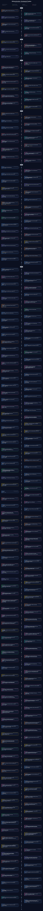

# 3D Reconstruction Development Timeline / 三维重建发展时间线

[← Back to the paper list / 返回论文列表](README.md)

> 131 papers from 2021 to the present. The central line runs from the earliest work at the top to the newest work at the bottom; cards alternate on both sides and colors represent the primary research direction.

> 共收录 131 篇论文。时间从上到下推进，论文交替分布在主线两侧，不同颜色对应不同研究方向。点击卡片中的 PAPER 或 CODE 可访问相关链接。

[Open full-size interactive SVG / 打开可点击的完整大图](https://raw.githubusercontent.com/Alleor/3D-reconstruction-paper/main/assets/timeline.svg)

## Trend matrix / 趋势矩阵

The counts below make changes in research activity easier to compare across years.

| Research direction | 2021 | 2022 | 2023 | 2024 | 2025 | 2026 | Total |
|:--|--:|--:|--:|--:|--:|--:|--:|
| 前馈几何与基础模型 Feed-Forward Geometry & Foundation Models | 0 | 0 | 0 | 2 | 10 | 31 | 43 |
| 稠密深度、表面与网格重建 Dense Depth, Surface & Mesh Reconstruction | 2 | 1 | 3 | 1 | 1 | 0 | 8 |
| NeRF 与新视角合成 NeRF & Novel View Synthesis | 3 | 2 | 0 | 0 | 5 | 7 | 17 |
| Gaussian Splatting Gaussian Splatting | 0 | 0 | 1 | 4 | 3 | 10 | 18 |
| 动态与 4D 重建 Dynamic & 4D Reconstruction | 2 | 0 | 1 | 2 | 5 | 3 | 13 |
| 对象、人体与 3D 生成 Object, Human & 3D Generation | 0 | 1 | 4 | 0 | 2 | 5 | 12 |
| 语义三维重建 Semantic 3D Reconstruction | 0 | 0 | 0 | 0 | 1 | 5 | 6 |
| SLAM、机器人与建图 SLAM, Robotics & Mapping | 1 | 1 | 4 | 5 | 1 | 2 | 14 |

---

This page and its SVG are regenerated automatically from `data/papers.json` during the weekly update.
